```{r setup, include=FALSE,}
knitr::opts_chunk$set(echo = TRUE,eval = FALSE)
```

#### Quick Links ####

[Google Drive Folder containing the data](https://drive.google.com/drive/folders/1wnwedxkSo_hoscvWFohUuApDrIH4CaOQ?usp=sharing)

[Shiny Dashboard](https://abhijith-asok.shinyapps.io/mashable_shares_prediction/)   
(In case you are not able to access the dashboard, kindly shoot an email to aasok@hsph.harvard.edu or chilger@hsph.harvard.edu and we'll restart the dashboard. RStudio's Shiny Server only allows a maximum of 1 hour of idle time before sending the dashboard to sleep)

[Summary video](https://www.youtube.com/watch?v=kBSfymZATfw&feature=youtu.be)

[GitHub Repo](https://github.com/abhijith-asok/BST-260-Final-project-Mashable-Prediction)


# Description

## Overview and Motivation

Media companies like Mashable produce tens of thousands of articles per year, all with varying degrees of virality. The virality of the content produced is key to a media company’s profitability. An accurate model that could predict parameters that increase the virality of an article, specifically, the number of social shares it receives, would be extremely valuable. 

This is of personal interest to us, since one of us comes from a marketing and product management background, while the other has had a respectable amount of experience in predictive model building.  We both had a desire to incorporate regression and machine learning techniques in this project. A short video summarising our approach and findings can be found [here](https://www.youtube.com/watch?v=kBSfymZATfw&feature=youtu.be).

## Related Work

This project allowed us to incorporate many techniques taught in the BST 260 class such as regression, decision trees and random forests, variable importance, data visualization with Shiny. Many of the prediction methods are time intensive, so we also applied knowledge from our BST 262 - Computing for Big Data course to track the processing times for each method and implement multicore parallel processing to speed up implementations.

## Initial Questions

The scientific goal is to develop a predictive model that can be used to determine the virality, number of shares generated, of a given piece of content. Authors at Mashable or a similar media company could then take findings from the model and further optimize the virality of the content.  These parameters could be simple things like word count of the title or paragraph or more complex changes, such as overall sentiment of the piece. 

Through developing more viral content, media companies will increase ad revenues and overall profitability. We primarily looked at this project through the eye of predictive modelling based on quantifiable article parameters like counts of words, pictures, videos etc. 

This objective evolved over the course of the project. Since the data was rather noisy, it was difficult to make a robust model that was generalizable enough. Specifically, the overall MAE (mean absolute error) was well into the 2000s [Range 1- ~ 150,000], so we switched our focus to finding a good balance between gains in MAE, computation time required for each analysis, and most important set of predictor variables.

## The Data

We started with a base dataset containing meta-data of nearly 40,000 unique Mashable blog articles over the past 5 years. The meta-data includes 61 different attributes ranging from metrics like word counts to sentiment analysis. This dataset is hosted on the Machine Learning Repository from the Center for Machine Learning and Intelligent Systems at the University of California Irvine. 

In addition to the meta-data, we were also interested in the actual article data, so we used a webscraper (using ‘rvest’) to collect the actual article titles, date published, author and article content. We joined these values into the base dataset.

## Dashboard

We created an interactive dashboard to further visualize the results.

[Dashboard](https://abhijith-asok.shinyapps.io/mashable_shares_prediction/) 

## Data Cleaning and Exploratory Data Analysis

To better understand our data, we first wanted to see how the number of shares varied for the articles in our data set. Looking at the summary information, we can see that the average article received about 3,400 shares.  Additionally, we see that the average shares per month varies, but does not show a general upward or downward trend. However, looking at a box and whisker plot, we see that there are many outliers that fell well above the mean.

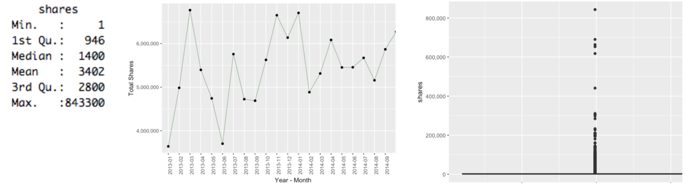

While we didn’t want to eliminate all outliers from our dataset, we did eliminate them based on Cook’s distance and business logic. This analysis indicated  that anything roughly over 150,000 shares would be flagged as an outlier, the thinking being that our model should be representative of the typical Mashable article. If it happens to underestimate the actual result, due to an extremely rare, and viral article, that is acceptable from our perspective, since the blog will simply have more virality than expected.

Additionally, there are 1,992 total authors of which, 1,328 of them only produced one article, as seen in the table below. We decided to also eliminate articles produced by authors who only published 1 article. This is because we want our model to be representative for staff authors, not simply guest contributors.

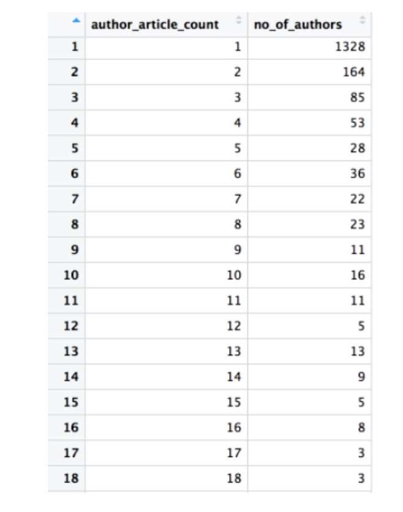

Looking at the predictors, there were several with descriptions in the data dictionary were not clear enough to understand, so we eliminated them. 

These included things that we believe were related to variables such as, kw_min_min, kw_max_min, kw_avg_min, kw_min_max, kw_max_max, kw_avg_max, kw_min_avg, kw_max_avg, kw_avg_avg. 

Additionally, there were predictors related to Latent Dirichlet Allocation (LDA). Specifically, there were five topics that were defined, namely, LDA_00, LDA_01, LDA_02, LDA_03, and LDA_04. 

However, the data dictionary did not contain the semantic meaning of these topics, or details of whether they were developed using the article titles, bodies, or both. Hence, we eliminated these as well. Instead, we conducted our own topic modeling, and developed 8 topics of our own.  These topics were developed using just the content in the article titles, not the article bodies. We did not have enough computational power to conduct an analysis on the body.

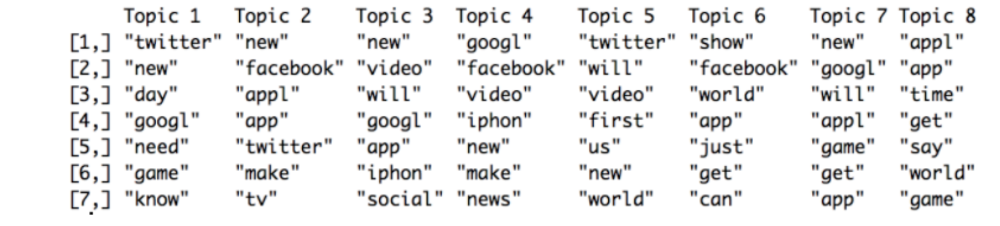

It is a bit challenging to apply a semantic understanding to each of these, but if we had to categorize them, we’d do so in the following way:

Topic 1: Need to know tech information
Topic 2: Large tech company new product announcement
Topic 3: Social media/app information
Topic 4: Video tech news
Topic 5: World news
Topic 6: Need to know world tech news
Topic 7: App and gaming news
Topic 8: World tech news

## Methods Considered

To achieve our goal of reducing Mean Absolute Error(MAE), we conducted the following tasks and analyses.

**Random Sampling** - In order to establish a train and test set of data, we conducted random sampling. Our train set contained a random sample of 90% of our data and our test set contained the remaining 10% of our data.  This split was chosen since we wanted to get the most out of our data and we were less concerned with overfitting since we incorporated Tree based models for our sophisticated analysis.

**Mean Measure of Central Tendency** - To get a baseline MAE which we could compare all future analyses to, we used the mean number of shares across the whole dataset for each prediction. We used this as a method to evaluate all subsequent analyses. If a particular subsequent analysis failed to improve beyond the baseline MAE, we did not move forward with further optimizing that method.

**Author Effect** - We succespeted that on average some authors might outperform others. Therefore, we calculated the mean number of shares that each author received, and then used this in addition to the baseline mean prediction.  However, this actually worsened our MAE relative to the baseline MAE, so we did not incorporate it for future models.

**Top Words Effect** - We succespeted that on average some words in article titles might lead to a greater number of shares on average. Specifically, our hunch was if the articles contained words like “iPhone” or “App”, this might lead to a larger number of shares since these were two very popular topics during the time the articles were published. We used the tm package in R to conduct the text processing.  

We first extracted all article titles and created a corpus. Then, we conducted various data manipulation, such as making all words lowercase, removing any non-english words, removing stop words, and stemming the corpus.  Then we converted the corpus to a term-document matrix, and determined the most frequent terms at a specific frequency cutoff.  From this list of frequent terms, we used our intuitive business sense to select which words we thought would lead to more more shares. We chose words like, “Appl”, “Googl”, “App” (Note, the word is “Appl” not “Apple” due to stemming). We placed these words in our “Top Word” list.

To produce the model, we calculated the mean shares of articles that contained words in our train set. Then we evaluated articles in our test set, if they contained top words, we applied the mean value for top word articles, if not we applied the mean value for non-top word articles.

Unfortunately, the top-word effect actually worsened our MAE relative to the baseline MAE, so we did not incorporate it for future models.

**Correlations** - When conducting regressions with multiple predictors, it is important to exclude variables that are strongly correlated with each other.  Additionally, viewing the correlations of predictors can help us understand which of the predictors are most strongly correlated with shares.  You can see the correlation plot below. From this correlation analysis, we decided to remove the variables from our regression models listed in the table below, as these were highly correlated with another variable. 

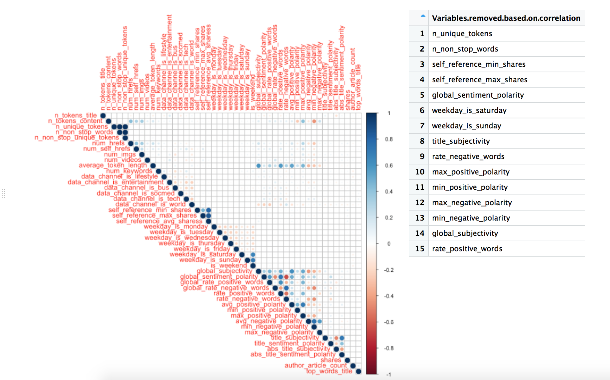

**Linear regression** - We started with a linear regression model of our data, as this is very simple  to implement and interpret.  

**Stepwise forward regression** - Given that we had many predictors, this method allowed us to incrementally incorporate the predictors which resulted in the lowest MAE. This allowed us to improve our MAE relative to the Base Linear Regression Model. (package - olsrr)

**Decision Trees** - Tree models are robust, meaning they are not impacted by correlations remaining in dataset.  This was advantageous to us given the large number of predictors we have. We developed a Decision Tree model to arrive at an MAE and also used it to create a    Variable Importance table (see below). (package - rpart)

**Random Forests** - Decision Trees are subject to overfitting whereas Random Forests are less so. Random Forests allowed us to lower our MAE further, and also gain exposure to Ensemble models. (package - caret, randomForest)

**Gradient Boosted Trees** - Gradient Boosted Trees are a deeper implementation of Random Forests. We suspected that they would further improve our MAE, since they incorporate incremental improvement in prediction within the Ensemble. Also, they are simply fascinating to use and used by most Kaggle Grandmasters. (package - caret, xgboost)

**Repeated Cross-Validation** - This method was used with Random Forests and Gradient Boosted Trees to further raise generalizability. (package - caret)

**Variable Importance** - This method allowed us to see which variables were most important in determining the number of shares.  By having a reduced number of predictors, we could conduct future analyses that required less computation time while still achieving close to the same MAE. Additionally, Variable Importance could allow for authors to better understand of which predictors are most important when creating content. Below we have shown a table listing the the most important variables, what each variable means, and a Pareto diagram indicating the relative importance of each variable. (package - rpart) 

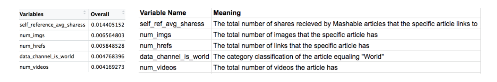

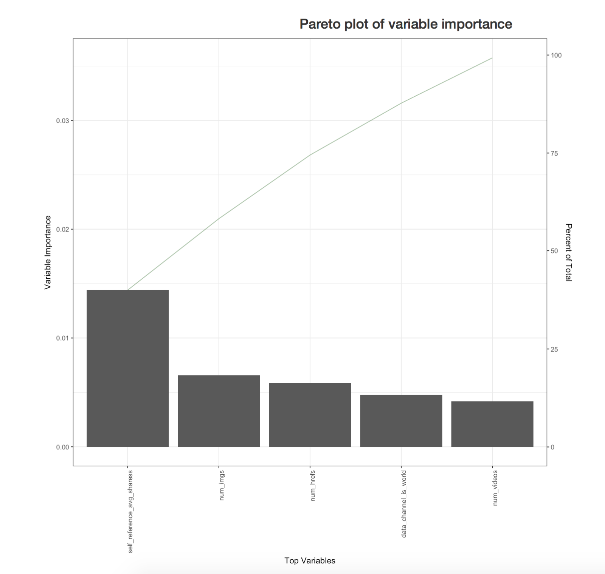

**Computation Time** - As we implemented more sophisticated models, they required more computation power and time. In an effort to a model that was scalable in the real world without the need for expensive hardware, we evaluated several of the major models developed on an MAE/computation time basis. The plots below show this relationship for our models.

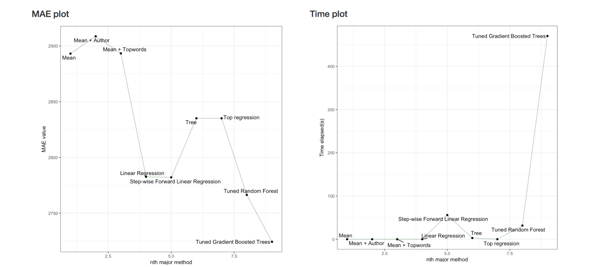

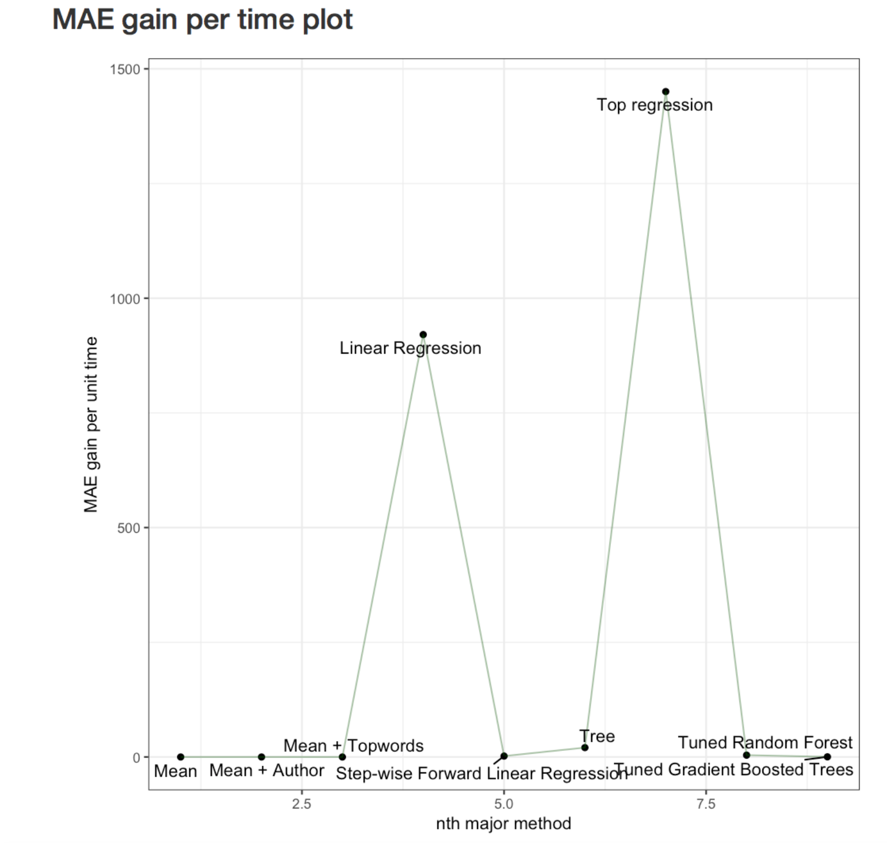

## Final Results

While we expected our task of predicting the number of shares for an article to be challenging, we now realize it is even more challenging than initially thought. For example, here are two articles, that are rather similar. Both discuss very popular tech products, Xbox and iPhone and have similar values for key metrics identified in the Variable Importance table above.  However, they have drastically different number of shares, 900 vs 197,000.

(Here are the links to the articles [Apple](http://mashable.com/2013/10/23/apple-new-ipads-brief/#W6ivLH0neiqu) and [Xbox](http://mashable.com/2013/12/25/xbox-one-getting-started/#BhHkViduzuqB))

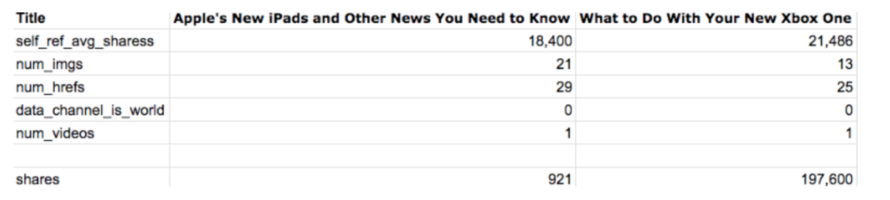

That said, we learned that it is possible to create a good model that utilizes a number of predictors to determine the number of shares a given article. Additionally, we found that through implementing more sophisticated methods like Random Forests and Gradient Boosted Trees, we could further reduce our MAE by over 130 points over the prediction using share mean. 

**The final boosted model had an MAE of 2724.32. On average, our model is able to predict the shares of mashable articles with a maximum positive/negative difference of just over 2,700 shares.**

Additionally, from our Variable Importance table, we can say that authors at Mashable should focus on creating content that include, links to other Mashable articles that received a large number of shares, many images and videos, many links. Additionally, the article should focus on topics other than those that would be classified as “world”.

In the event that an author at Mashable does not have access to the computing power or knowledge required to run the more sophisticated models, he/she could simply conduct a regression using the variables listed in the Variable Importance table above, and still obtain useful results in a fraction of the time.

Last, we created a Shiny Dashboard to better visualize the major data used in our analysis.

[Interactive Dashboard](https://abhijith-asok.shinyapps.io/mashable_shares_prediction/) 

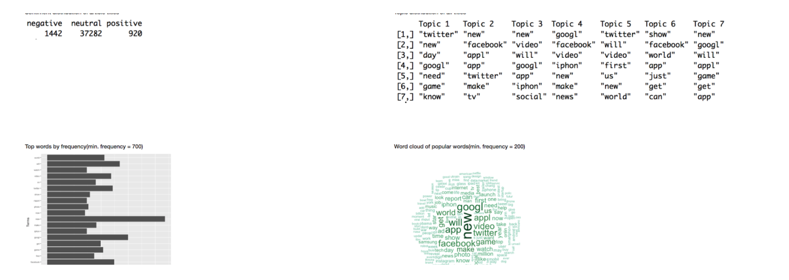

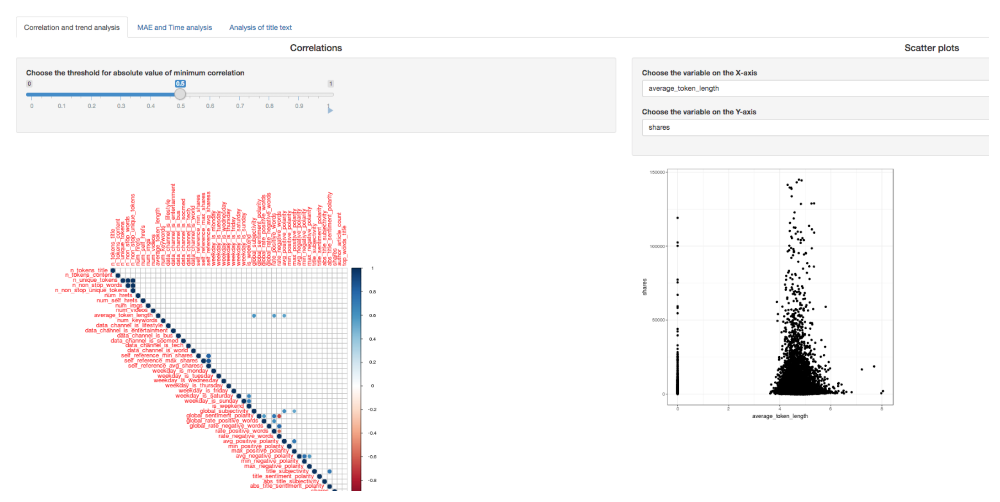

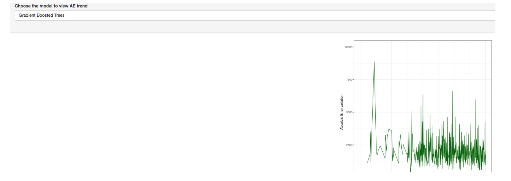

## Improvements

If were were to complete this project again, the following, if possible, would be helpful:

- **Having more data**: We had ~40,000 articles which is on the small side for having so many predictors. To put this in perspective, the Netflix Prize utilized over 100MM ratings, and had 4 predictors..  More data certainly would have helped us to create better models and therefore better predictions.

- **Better clarity regarding what each variable meant in the UCIrvine dataset**: As cited above, many variables were not properly defined in the data dictionary, so we had no choice but to throw them out from our analysis.

- **More computational power and time**: We could have applied NLP to the article content itself, rather than just the titles. From this, we could have generated potentially a better model, than what we were able to derive from just the titles. Additionally, we incorporated preliminary neural networks and deep learning implementations using H2O, but did not include them in our final analysis. They required significant time and computation power, to properly tune and execute the analysis, which were not at our disposal. Last, we could have applied more trees to our Gradient Boosted Tree analysis.

# Code

##Web scraping code

```{r}
library(rvest)
library(tidyverse)

#read in csv

MyData <- read.csv(file="OnlineNewsPopularity.csv", header=TRUE, sep=",", stringsAsFactors = FALSE)

MyData_abb <- head(MyData,100)

#get get the urls and make the a list

urls <- data.frame( MyData_abb$url)

#define the function to get the article content


get_text <- function(x){

  y <- read_html(x)
  
  
#get the article content
  
  
  text <- y %>%
  html_node(".article-content") %>%
  html_text()
  
  
#get the author name
   a <- y %>%
    html_node(".author_name a") %>%
  html_text()
  

  if(!is.na(a)) {
    
    a <- a
    
    }
  
  if(is.na(a)) {
    
     b <- y  %>%
       html_node(".basic") %>%
       html_text()
     
     a <- b
  }
   
   
#get the title
  title <- y %>%
  html_node(".title") %>%
  html_text()
  
#get the date
 
  date <- y %>%
  html_node("time") %>%
  html_text()
  
  

  
  return(data.frame(date = date, title = title, author = a, text = text, stringsAsFactors=F))


}

#title_all <- apply(urls, 1, get_title)
#date_all <- apply(urls, 1, get_date)
#author_all <- apply(urls, 1, get_author)


#this one below works
#text_all <- apply(urls, 1, get_text)

text_all <- do.call("rbind", apply(urls, 1, get_text))

#add an id to the left of the data frame

id_df <- data.frame(id = seq.int(nrow(text_all)))

total_df <- cbind(id_df, text_all)
```

##Load libraries.

```{r, warning=FALSE}
library(tidyverse)
library(caret)
```

##Load data.

```{r}
#Data read
mash_data <- read.csv("/Users/abhijithasok/Documents/Harvard_Health_Data_Science/Fall_2017/Intro to Data Science/Project//OnlineNewsPopularity/OnlineNewsPopularity.csv",header = T,colClasses = c('character',rep('numeric',12),rep('factor',6),rep('numeric',12),rep('factor',8),rep('numeric',22)))

#Original data preservation
mash_work <- mash_data

#Reading in data about articles scraped from Mashable using URL
scraped_data <- read.csv("/Users/abhijithasok/Documents/Harvard_Health_Data_Science/Fall_2017/Intro to Data Science/Project/ScrapedDataFull.csv",header = T)

scraped_data$X.1 <- NULL
scraped_data$X <- NULL
```

##Adding IDs

```{r}
id <- seq(1,nrow(mash_work),1)
mash_work <- cbind(id,mash_work)
```

##Adding scraped data

```{r}
#Joining the major variables of the scraped data to the main dataset
mash_work <- mash_work %>% left_join(scraped_data[,c("id","date","author","title")],by="id")
```

##Assumption - All authors have written more than one article. Remove authors with just 1 article from the data.

```{r}
#Number of articles by author
article_count_by_author <- mash_work %>%
                            group_by(author) %>%
                            dplyr::summarise(author_article_count = n())

#Adding this column to main dataset
mash_work <- mash_work %>% left_join(article_count_by_author,by="author")

#Removing articles written by authors who haven't written anything else
mash_work <- mash_work %>% filter(author_article_count > 1)
```

##Split into train and test.

```{r}
set.seed(10)
train_Index <- createDataPartition(mash_work$shares, times = 1, p=0.9, list = F)
mash_work_train <- mash_work[train_Index,]
mash_work_test <- mash_work[-train_Index,]
```

##Outlier Removal

```{r}
mash_work_train <- mash_work_train %>% filter(shares < 150000) #Outlier removal
share_mean <- mean(mash_work_train$shares)
#write.csv(mash_work_train,"Final train full.csv",row.names = FALSE)
```

##Total shares per month over time

```{r,eval=FALSE}
library(lubridate)
#plot shares over time

# 3. Using 'lubridate' to create a Date or POSIXct object (see 'tz' argument in ?ymd):

lolz <- mash_work

lolz$Datum <- as.Date(as.character(lolz$date)) #format = "%m/%d/%y")

lolz$Datum <- as.Date(lolz$Datum, "%m/%y")

lolz$Datum <- format(as.Date(lolz$Datum),"%Y-%m")


lolz <- lolz %>% group_by(Datum) %>%
  summarize(Total_Shares = sum(shares))


#, origin = "1970-1-1"
#lolz$Datum <- as.POSIXct(lolz$date)
#lolz$Datum  <- ymd(lolz$Datum)

lolz <- head(lolz, -2) 

ggplot(data=lolz, aes(x=Datum , y=Total_Shares, group = 1)) + geom_line(aes(x=Datum , y=Total_Shares),color='darkgreen', alpha = 0.4) + geom_point()+
  theme(axis.text.x = element_text(angle = 90, hjust = 1)) +
  scale_y_continuous(labels = comma) +
  xlab("Year - Month") + 
  ylab("Total Shares")
```


##Baseline prediction with share mean.

```{r}
#Table to share MAEs
mae_list <- data.frame(method = character(), mae = numeric(),stringsAsFactors = FALSE)
time_list <- data.frame(method = character(), time = numeric(),stringsAsFactors = FALSE)

#Predicting with mean
share_mean <- mean(mash_work_train$shares)
prediction_list <- data.frame(id = mash_work_test$id, shares = mash_work_test$shares, predicted_shares = share_mean)

ae_list <- prediction_list %>% 
        dplyr::mutate(absolute_error = abs(shares - predicted_shares)) %>%
        dplyr::group_by(shares) %>%
        dplyr::summarise(ae_mean = mean(absolute_error))

MAE(prediction_list$shares,prediction_list$predicted_shares, na.rm = TRUE)

#Adding MAE and system time(here, negligible, so 0) to respective tables
c=1
mae_list[c,] <- c("Uniform prediction with mean of all shares",MAE(prediction_list$shares,prediction_list$predicted_shares, na.rm = TRUE))
time_list[c,] <- c("Uniform prediction with mean of all shares",0.0)
c<-c+1
```

##Author effect - No regularization

```{r}
author_means <- mash_work_train %>% 
                  group_by(author) %>%
                  dplyr::summarise(author_effect = mean(shares - share_mean))

prediction_list <- data.frame(id = mash_work_test$id, shares = mash_work_test$shares, author = mash_work_test$author)

prediction_list <- prediction_list %>% left_join(author_means,by="author")

prediction_list <- prediction_list %>%
                    mutate(predicted_shares = share_mean + author_effect)

ae_list <- cbind(ae_list,prediction_list %>% 
        dplyr::mutate(absolute_error = abs(shares - predicted_shares)) %>%
        dplyr::group_by(shares) %>%
        dplyr::summarise(ae_mean_author = mean(absolute_error)) %>%
        dplyr::select(ae_mean_author))
        
#Calculating MAE
MAE(prediction_list$shares,prediction_list$predicted_shares, na.rm = TRUE)

#Adding MAE and system time(here, negligible, so 0) to respective tables
mae_list[c,] <- c("Prediction with Mean and Author effect",MAE(prediction_list$shares,prediction_list$predicted_shares, na.rm = TRUE))
time_list[c,] <- c("Prediction with Mean and Author effect",0.0)
c<-c+1 
```

## Processing of Title text

```{r,eval = FALSE}
library(tm)

articles <- mash_work_train

#Converting to corpus
article_corpus <- Corpus(VectorSource(articles$title))

#Converting to lower case
article_corpus <- tm_map(article_corpus, content_transformer(tolower))

#Remove URLs
removeURL <- function(x) gsub("http[^[:space:]]*", "", x)
article_corpus <- tm_map(article_corpus, content_transformer(removeURL))

#Keep only English letters and space
removeNumPunct <- function(x) gsub("[^[:alpha:][:space:]]*", "", x)
article_corpus <- tm_map(article_corpus, content_transformer(removeNumPunct))

#Remove stopwords
myStopwords <- c(stopwords('english'), "mashable")
article_corpus <- tm_map(article_corpus, removeWords, myStopwords)

#Remove extra whitespace
article_corpus <- tm_map(article_corpus, stripWhitespace)

#Copy for stem completion
article_corpus_copy <- article_corpus

#Stem Document
article_corpus <- tm_map(article_corpus, content_transformer(stemDocument))

#Document - Term Matrix
tdm <- TermDocumentMatrix(article_corpus,
                          control = list(wordLengths = c(1, Inf),weighting = weightTfIdf))

#Frequent terms
freq.terms <- findFreqTerms(tdm, lowfreq = 300)

#TFIDF
dtm <- as.DocumentTermMatrix(tdm,control = list(weighting = function(x) weightTfIdf(x, normalize = FALSE)))

freq.terms <- findFreqTerms(dtm, lowfreq = 200)

write.csv(tdm,"Mashable TDM.csv")

system.time(term.freq <- rowSums(as.matrix(tdm)))
term.freq1 <- subset(term.freq, term.freq >= 200)
df <- data.frame(term = names(term.freq1), freq = term.freq1)

png("Top words more than 700.png")
ggplot(df, aes(x=term, y=freq)) + geom_bar(stat="identity") +
  xlab("Terms") + ylab("Count") + coord_flip() +
  theme(axis.text=element_text(size=7))
dev.off()

#Wordcloud
m <- as.matrix(tdm)
word.freq <- sort(rowSums(m), decreasing = T)
pal <- brewer.pal(9, "BuGn")[-(1:4)]
# plot word cloud
library(wordcloud)

png("Wordcloud_min 200.png")
wordcloud(words = names(word.freq), freq = word.freq, min.freq = 200,
          random.order = F, colors = pal)
dev.off()

#Associations
findAssocs(tdm, "facebook",0.1)

#Network of terms
library(graph)
library(Rgraphviz)
plot(tdm, term = freq.terms, corThreshold = 0, weighting = T)

#Topic Modelling
dtm <- as.DocumentTermMatrix(tdm)
library(topicmodels)
rowTotals <- apply(dtm , 1, sum) #Find the sum of words in each Document
dtm.new   <- dtm[rowTotals> 0, ]
lda <- LDA(dtm.new,k=8)
term <- terms(lda,7)

## Cant do this because some rows were removed. Need to Lookup dates and do it
topics <- topics(lda) #First topic identified for every document
topics <- data.frame(date=as.Date(articles$date), topic=topics)

#Sentiment Analysis
library(sentiment)
sentiments <- sentiment(articles$title)
table(sentiments$polarity)
```

## Text effects - Top words with TF > 300 ( Note io to ios)

```{r}
top_words <- c("twitter", "facebook", "app", "appl", "googl", "iphon", "amazon", "video", "obama", "photo", "smartphon", "instagram", "microsoft", "android", "mobil", "samsung", "youtub", "vine", "ipad", "million", "trailer", "internet", "ios", "tech")

mash_work_train$title <- tolower(mash_work_train$title)
mash_work_test$title <- tolower(mash_work_test$title)

mash_work_train <- mash_work_train %>%
                    mutate(top_words_title = ifelse(grepl(paste(top_words,collapse = "|"),title),1,0))

mash_work_test <- mash_work_test %>%
                    mutate(top_words_title = ifelse(grepl(paste(top_words,collapse = "|"),title),1,0))
```

##Topword effect

```{r}
shares_by_topwords <- mash_work_train %>%
                        group_by(top_words_title) %>%
                        dplyr::summarise(topword_effect = mean(shares - share_mean))

prediction_list <- prediction_list %>% left_join(mash_work_test[,c("id","top_words_title")],by="id")

prediction_list <- prediction_list %>% left_join(shares_by_topwords,by="top_words_title")

prediction_list <- prediction_list %>%
                    mutate(predicted_shares = share_mean + topword_effect)

ae_list <- cbind(ae_list,prediction_list %>% 
        dplyr::mutate(absolute_error = abs(shares - predicted_shares)) %>%
        dplyr::group_by(shares) %>%
        dplyr::summarise(ae_mean_topword = mean(absolute_error)) %>%
        dplyr::select(ae_mean_topword))

#Calculating MAE
MAE(prediction_list$shares,prediction_list$predicted_shares, na.rm = TRUE)

#Adding MAE and system time(here, negligible, so 0) to respective tables
mae_list[c,] <- c("Prediction with Mean and topwords effect",MAE(prediction_list$shares,prediction_list$predicted_shares, na.rm = TRUE))
time_list[c,] <- c("Prediction with Mean and topwords effect",0.0)
c<-c+1
```

## Clearing unused character and factor variables for modelling

```{r}
mash_work_train <- mash_work_train[,-c(2:3,21:29,41:45)]
mash_work_test <- mash_work_test[,-c(2:3,21:29,41:45)]
mash_work_train$author_article_count <- as.numeric(mash_work_train$author_article_count)
mash_work_test$author_article_count <- as.numeric(mash_work_test$author_article_count)
```

##Correlations

```{r}
m <- cor(mash_work_train[,sapply(mash_work_train,is.numeric)])
m <- m[-1,-1]
```

##Baseline regression

```{r, warning=FALSE}
mash_work_train_selected <- mash_work_train[,-which(names(mash_work_train) %in% c("id","date","author","title","n_unique_tokens","n_non_stop_words","self_reference_min_shares","self_reference_max_shares","global_sentiment_polarity","weekday_is_saturday","weekday_is_sunday","title_subjectivity","rate_negative_words","max_positive_polarity","min_positive_polarity","max_negative_polarity","min_negative_polarity","global_subjectivity","rate_positive_words"))]

mash_work_test_selected <- mash_work_test[,-which(names(mash_work_test) %in% c("id","date","author","title","n_unique_tokens","n_non_stop_words","self_reference_min_shares","self_reference_max_shares","global_sentiment_polarity","weekday_is_saturday","weekday_is_sunday","title_subjectivity","rate_negative_words","max_positive_polarity","min_positive_polarity","max_negative_polarity","min_negative_polarity","global_subjectivity","rate_positive_words"))]

# tofactor <- mash_work_train_selected[,c(10:15,17:22,32)]
# tofactor <- data.frame(apply(tofactor, 2, as.factor))
# mash_work_train_selected <- cbind(mash_work_train_selected[,-c(10:15,17:22,32)],tofactor)
# 
# tofactor <- mash_work_test_selected[,c(10:15,17:22,32)]
# tofactor <- data.frame(apply(tofactor, 2, as.factor))
# mash_work_test_selected <- cbind(mash_work_test_selected[,-c(10:15,17:22,32)],tofactor)

time <- system.time(regmodel <- lm(shares ~ ., data=mash_work_train_selected,na.action = na.omit))
            
predictions <- predict(regmodel, newdata = mash_work_test[,-which(names(mash_work_test) %in% c("date","author","title"))])

prediction_list <- data.frame(id = mash_work_test$id, shares = mash_work_test$shares, predicted_shares = predictions)

ae_list <- cbind(ae_list,prediction_list %>% 
        dplyr::mutate(absolute_error = abs(shares - predicted_shares)) %>%
        dplyr::group_by(shares) %>%
        dplyr::summarise(ae_reg = mean(absolute_error)) %>%
        dplyr::select(ae_reg))

#Calculating MAE
MAE(prediction_list$shares,prediction_list$predicted_shares, na.rm = TRUE)

#Adding MAE and system time(here, negligible, so 0) to respective tables
mae_list[c,] <- c("Regression with all variables after correlation treatment",MAE(prediction_list$shares,prediction_list$predicted_shares, na.rm = TRUE))
time_list[c,] <- c("Regression with all variables after correlation treatment",time[3])
c<-c+1

# cooks <- data.frame(id = mash_work_train_selected$id,dist = cooks.distance(regmodel),shares=mash_work_train_selected$shares)
# 
# pot_out <- cooks %>% filter(dist > 3*mean(cooks$dist))
# 
# mash_work_train_selected <- mash_work_train_selected %>% filter(!(id %in% pot_out$id))
```

##Step-wise forward regression

```{r}
library(olsrr)
time1 <- system.time(olsforward <- ols_step_forward(regmodel))

#removed_vars <- olsback$removed

time2 <- system.time(regmodel1 <- lm(as.formula(paste("shares ~ ",paste(olsforward$predictors,collapse = "+"),sep="")), data=mash_work_train[,-which(names(mash_work_train) %in% c("id","date","author","title","n_unique_tokens","n_non_stop_words","self_reference_min_shares","self_reference_max_shares","global_sentiment_polarity","weekday_is_saturday","weekday_is_sunday","title_subjectivity","rate_negative_words","max_positive_polarity","min_positive_polarity","max_negative_polarity","min_negative_polarity","global_subjectivity","rate_positive_words"))]))
predictions <- predict(regmodel1, newdata = mash_work_test[,-which(names(mash_work_test) %in% c("id","date","author","title"))])

prediction_list <- data.frame(id = mash_work_test$id, shares = mash_work_test$shares, predicted_shares = predictions)

ae_list <- cbind(ae_list,prediction_list %>% 
        dplyr::mutate(absolute_error = abs(shares - predicted_shares)) %>%
        dplyr::group_by(shares) %>%
        dplyr::summarise(ae_fwd_reg = mean(absolute_error)) %>%
        dplyr::select(ae_fwd_reg))

#Calculating MAE
MAE(prediction_list$shares,prediction_list$predicted_shares, na.rm = TRUE)

#Adding MAE and system time(here, negligible, so 0) to respective tables
mae_list[c,] <- c("Step-wise forward regression",MAE(prediction_list$shares,prediction_list$predicted_shares, na.rm = TRUE))
time_list[c,] <- c("Step-wise forward regression",time1[3] + time2[3])
c<-c+1
```

##Decision Tree

```{r}
library(rpart)
time <- system.time(tree_model <- rpart(shares ~ . , data = mash_work_train_selected, control = rpart.control(minsplit = 20)))

predictions <- predict(tree_model, newdata = mash_work_test_selected)

prediction_list <- data.frame(id = mash_work_test$id, shares = mash_work_test$shares, predicted_shares = predictions)

ae_list <- cbind(ae_list,prediction_list %>% 
        dplyr::mutate(absolute_error = abs(shares - predicted_shares)) %>%
        dplyr::group_by(shares) %>%
        dplyr::summarise(ae_tree = mean(absolute_error)) %>%
        dplyr::select(ae_tree))

#Calculating MAE
MAE(prediction_list$shares,prediction_list$predicted_shares, na.rm = TRUE)

#Adding MAE and system time(here, negligible, so 0) to respective tables
mae_list[c,] <- c("Decision Tree with non-correlated variables",MAE(prediction_list$shares,prediction_list$predicted_shares, na.rm = TRUE))
time_list[c,] <- c("Decision Tree with non-correlated variables",time[3])
c<-c+1
```

##Variable importance using decision tree 

```{r}
vi <- varImp(tree_model)
temp_rownames <- rownames(vi)
vi$Variables <- temp_rownames
rownames(vi) <- NULL
vi <- vi[,c(2,1)]
vi <- vi %>% arrange(desc(Overall))
vipos <- vi %>% filter(Overall != 0) %>% .$Variables
```

##Regression using top variables only

```{r}
time <- system.time(regmodelmin <- lm(shares ~ . , data = mash_work_train_selected[,which(names(mash_work_train_selected) %in% c(vipos,"shares"))]))

predictions <- predict(tree_model, newdata = mash_work_test_selected)

prediction_list <- data.frame(id = mash_work_test$id, shares = mash_work_test$shares, predicted_shares = predictions)

ae_list <- cbind(ae_list,prediction_list %>% 
        dplyr::mutate(absolute_error = abs(shares - predicted_shares)) %>%
        dplyr::group_by(shares) %>%
        dplyr::summarise(ae_reg_top = mean(absolute_error)) %>%
        dplyr::select(ae_reg_top))

#Calculating MAE
MAE(prediction_list$shares,prediction_list$predicted_shares, na.rm = TRUE)

#Adding MAE and system time(here, negligible, so 0) to respective tables
mae_list[c,] <- c("Regression using top variables only",MAE(prediction_list$shares,prediction_list$predicted_shares, na.rm = TRUE))
time_list[c,] <- c("Regression using top variables only",time[3])
c<-c+1
```

Just the top 5 predictors bring down the MAE significantly compared to predicting using the mean for all observations.

##CV Random Forest

```{r}
set.seed(10)
library(randomForest)
library(doMC)
registerDoMC(cores = 6)
# system.time(res <- train(as.formula(paste("shares ~ ",paste(olsforward$predictors,collapse = "+"),sep="")),
#              data = (mash_work_train_selected),
#               method = "rf",
#               ntree = 500,
#               maxnodes = 20,
# #              nodesize = 20,
#               tuneGrid = expand.grid(.mtry=round(ncol(mash_work_train_selected))/3),
#               trControl = trainControl(method='repeatedcv', number=3, repeats=3, allowParallel = TRUE),
#               metric="mae"))


time <- system.time(res <- train(shares ~ .,
             data = (mash_work_train_selected),
              method = "rf",
              ntree = 100,
              maxnodes = 20,
#              nodesize = 20,
              tuneGrid = expand.grid(.mtry=round(ncol(mash_work_train_selected)/2)),
              trControl = trainControl(method='repeatedcv', number=3, repeats=3,allowParallel = TRUE),
              metric="MAE"))

predictions <- predict(res, newdata = mash_work_test_selected)

prediction_list <- data.frame(id = mash_work_test$id, shares = mash_work_test$shares, predicted_shares = predictions)

ae_list <- cbind(ae_list,prediction_list %>% 
        dplyr::mutate(absolute_error = abs(shares - predicted_shares)) %>%
        dplyr::group_by(shares) %>%
        dplyr::summarise(ae_rf = mean(absolute_error)) %>%
        dplyr::select(ae_rf))

#Calculating MAE
MAE(prediction_list$shares,prediction_list$predicted_shares, na.rm = TRUE)

#Adding MAE and system time(here, negligible, so 0) to respective tables
mae_list[c,] <- c("Tuned Random Forest with repeated cross-validation and parallel processing",MAE(prediction_list$shares,prediction_list$predicted_shares, na.rm = TRUE))
time_list[c,] <- c("Tuned Random Forest with repeated cross-validation and parallel processing",time[3])
c<-c+1
```

##CV XGBoost

```{r}
set.seed(10)
library(xgboost)
library(doMC)
registerDoMC(cores = 8)
# system.time(res <- train(as.formula(paste("shares ~ ",paste(olsforward$predictors,collapse = "+"),sep="")),
#              data = (mash_work_train_selected),
#               method = "rf",
#               ntree = 500,
#               maxnodes = 20,
# #              nodesize = 20,
#               tuneGrid = expand.grid(.mtry=round(ncol(mash_work_train_selected))/3),
#               trControl = trainControl(method='repeatedcv', number=3, repeats=3, allowParallel = TRUE),
#               metric="mae"))

parametersGrid <-  expand.grid(eta = 0.005, 
                            colsample_bytree=c(0.5,0.7),
                            max_depth=c(4,5),
                            nrounds=2000,
                            gamma=1,
                            min_child_weight=2,
                            subsample=0.75
                            )
set.seed(10)
time <- system.time(res <- train(shares ~ .,
             data = (mash_work_train_selected),
              method = "xgbTree",
              ntree = 10,
              maxnodes = 20,
#              nodesize = 20,
              tuneGrid = parametersGrid,
              verbose = TRUE,
              trControl = trainControl(method='repeatedcv', number=3, repeats=3,allowParallel = TRUE),
              metric="MAE"))

predictions <- predict(res, newdata = mash_work_test_selected)

prediction_list <- data.frame(id = mash_work_test$id, shares = mash_work_test$shares, predicted_shares = predictions)

ae_list <- cbind(ae_list,prediction_list %>% 
        dplyr::mutate(absolute_error = abs(shares - predicted_shares)) %>%
        dplyr::group_by(shares) %>%
        dplyr::summarise(ae_xgb = mean(absolute_error)) %>%
        dplyr::select(ae_xgb))

#Calculating MAE
MAE(prediction_list$shares,prediction_list$predicted_shares, na.rm = TRUE)

#Adding MAE and system time(here, negligible, so 0) to respective tables
mae_list[c,] <- c("Tuned Gradient Boosted Trees with repeated cross-validation and parallel processing",MAE(prediction_list$shares,prediction_list$predicted_shares, na.rm = TRUE))
time_list[c,] <- c("Tuned Gradient Boosted Trees with repeated cross-validation and parallel processing",time[3])
c<-c+1
```

#MAE table format and save

```{r}
mae_list$mae <- as.numeric(mae_list$mae)
mae_list <- mae_list %>% mutate(mae = round(mae,digits=2))
nos <- seq(1,nrow(mae_list),1)
algos <- c("Mean","Mean + Author","Mean + Topwords","Linear Regression","Step-wise Forward Linear Regression","Tree","Top regression","Tuned Random Forest","Tuned Gradient Boosted Trees")
mae_list <- cbind(nos,algos,mae_list)
write.csv(mae_list,"Mashable_shares_prediction/MAEs.csv",row.names = FALSE)
```

# Time table format and save

```{r}
time_list$time <- as.numeric(time_list$time)
time_list <- time_list %>% mutate(time = round(time,digits=2))
nos <- seq(1,nrow(time_list),1)
algos <- c("Mean","Mean + Author","Mean + Topwords","Linear Regression","Step-wise Forward Linear Regression","Tree","Top regression","Tuned Random Forest","Tuned Gradient Boosted Trees")
time_list <- cbind(nos,algos,time_list)
write.csv(time_list,"Mashable_shares_prediction/times.csv",row.names = FALSE)
```

# MAE gain compared to share mean per unit time

```{r}
mae_list <- read.csv("Mashable_shares_prediction/MAEs.csv",header = TRUE)
time_list <- read.csv("Mashable_shares_prediction/times.csv",header = TRUE)
mae_list <- mae_list %>% left_join(time_list,by=c("nos","method","algos")) %>% 
                  mutate(mae_gain = mae[1] - mae, mae_gain_time = ifelse(time == 0,0,mae_gain/time))
write.csv(mae_list,"Mashable_shares_prediction/mae_time.csv",row.names = FALSE)
```

#AE table

```{r}
write.csv(ae_list,"Mashable_shares_prediction/AE_list.csv",row.names = FALSE)
```


#h2o

```{r}
# library(h2o)
# localH2O <- h2o.init(min_mem_size = "20g")
# train_h2o <- as.h2o(mash_work_train_selected, key="train_h2o")
# test_h2o <- as.h2o(mash_work_test_selected, key="train_h2o")
# model <- h2o.deeplearning( x = c(1:29,31:32),  # column numbers for predictors
#                y = 20,   # column number for label
#                training_frame = train_h2o, # data in H2O format
#                stopping_metric = "mae",
#                activation = "TanhWithDropout", # or 'Tanh'
#                input_dropout_ratio = 0.2, # % of inputs dropout
#                hidden_dropout_ratios = c(0.5,0.5,0.5), # % for nodes dropout
#                balance_classes = TRUE, 
#                hidden = c(50,50,50), # three layers of 50 nodes
#                epochs = 100)
# 
# predictions <- h2o.predict(model, newdata = test_h2o)
# 
# prediction_list <- data.frame(id = mash_work_test$id, shares = mash_work_test$shares, predicted_shares = predictions)
# 
# ModelMetrics::mae(prediction_list$shares,prediction_list$predicted_shares)
 ```